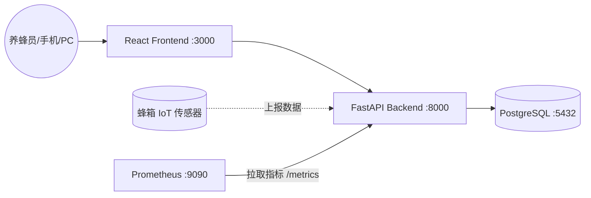

# 🐝 HiveOps · 蜂场养殖管理平台

> 一个面向中小型养蜂场的可观测性数字化管理平台。
> 让蜂农像运维数据中心一样运维蜂场：每一箱蜂群都有档案、每一次巡检都有记录、每一根温度曲线都能追溯告警。
>
> 基于 **React + FastAPI + PostgreSQL + Prometheus** 全栈构建，100% 容器化，`docker compose up` 一键启动。

## 🎯 产品定位

养蜂行业仍大量依赖纸质本子和经验记忆，蜂群异常往往等到开箱才发现，信息无法沉淀也难以传承。
HiveOps 把养蜂场视为一个"小型分布式系统"：蜂场是机房、蜂箱是节点、传感器是 exporter、采蜜批次是业务交易，用现代可观测性的思路重新组织养蜂数据，让经验可量化、问题可预警、产出可追溯。

## 🏗 架构设计



1.  **React Frontend**：养蜂员现场用手机、场长在 PC 端管理，提供蜂场总览、蜂箱档案、巡检记录、告警面板。
2.  **FastAPI Backend**：承接业务读写与 IoT 传感器上报，集成 `prometheus-fastapi-instrumentator` 自动暴露监控标准指标。
3.  **PostgreSQL**：持久化所有蜂场、蜂箱、巡检、采蜜、传感器历史等结构化数据。
4.  **Prometheus**：周期性从后端 `/metrics` 拉取指标，承担"蜂场可观测性中枢"。

## 🛠 技术栈

| 模块 | 技术 |
| :--- | :--- |
| Frontend | React 18 + Tailwind CSS + Lucide Icons |
| Backend | FastAPI + SQLAlchemy + Pydantic |
| Database | PostgreSQL 15 |
| Monitoring | Prometheus |
| Infrastructure | Docker + Docker Compose |

## 🚀 启动指南

1. 安装 **Docker** 与 **Docker Compose**。
2. 在仓库根目录执行：
   ```bash
   docker compose up --build
   ```
3. 等待所有容器进入健康状态（后端会自动完成数据库迁移与种子数据初始化）。

## 🔗 服务地址

| 服务 | 地址 |
| :--- | :--- |
| 前端控制台 | [http://localhost:3000](http://localhost:3000) |
| 后端 Swagger | [http://localhost:8000/docs](http://localhost:8000/docs) |
| 后端 Metrics | [http://localhost:8000/metrics](http://localhost:8000/metrics) |
| Prometheus 面板 | [http://localhost:9090](http://localhost:9090) |

---

## 📊 蜂场可观测性指标

> 当前仓库的后端已经把 Prometheus 监控链路打通。本节列出蜂场业务模型最终要承载的指标定义，这些业务指标会在后续 Feature 任务中陆续接入。

### 1. 蜂群活跃度（出入巢频次）
- **指标名**：`hive_bee_traffic_per_minute`
- **类型**：Gauge
- **PromQL 示例**：`avg by (hive_id) (hive_bee_traffic_per_minute)`
- **说明**：单位时间内蜂箱出入巢的蜜蜂数量，反映蜂群活力，明显下降往往预示着病害或失王。

### 2. 蜂箱重量（采蜜进度 / 失重告警）
- **指标名**：`hive_weight_kg`
- **类型**：Gauge
- **PromQL 示例（24h 增重）**：`hive_weight_kg - hive_weight_kg offset 24h`
- **说明**：蜂箱总重随采蜜进度增长，骤降则可能是分蜂、盗蜂或人为搬动。

### 3. 蜂箱温度
- **指标名**：`hive_temperature_celsius`
- **类型**：Gauge
- **PromQL 示例**：`hive_temperature_celsius > 38`
- **说明**：蜂巢内核心温度恒定在 34~36℃，过高过低都需要预警。

### 4. 累计采蜜量
- **指标名**：`apiary_harvest_kg_total`
- **类型**：Counter
- **PromQL 示例**：`sum by (apiary_id) (increase(apiary_harvest_kg_total[30d]))`
- **说明**：以蜂场为维度累计的采蜜重量。

### 5. 巡检耗时分布
- **指标名**：`hive_inspection_duration_seconds_bucket`
- **类型**：Histogram
- **PromQL（P95）示例**：`histogram_quantile(0.95, sum by (le) (rate(hive_inspection_duration_seconds_bucket[1h])))`
- **说明**：单次开箱巡检的耗时分布，过长可能意味着蜂群异常或新手养蜂员需要培训。

---

## 🗺 演进路线

当前仓库可视为 HiveOps 的**基础架构脚手架**：技术栈、容器编排、监控链路、CI/CD 模板均已就绪，业务能力将按 [`TASK_PROMPTS.md`](./TASK_PROMPTS.md) 中规划的迭代任务逐步落地，涵盖：

- 蜂箱档案管理与生命周期（建箱 / 检查 / 迁场 / 退役）
- 蜂群巡检记录与异常事件追溯
- IoT 传感器接入、限流与设备注册中心
- 蜂群告警规则、告警中心与站内消息
- 采蜜批次、蜂蜜库存、蜂蜜溯源
- 女王蜂血统家谱、病虫害知识库
- 多角色权限、审计日志、报表邮件
- 全栈可观测性（指标 / 日志 / 链路追踪）大屏

## 🧪 验收建议

1. `docker compose up --build` 启动并确认全部容器健康。
2. 访问前端控制台，按当前已实现的页面进行交互。
3. 访问 [http://localhost:8000/metrics](http://localhost:8000/metrics) 查看后端暴露的 Prometheus 指标。
4. 在 [http://localhost:9090](http://localhost:9090) 输入示例 PromQL（如 `rate(http_requests_total[1m])`）验证抓取链路。
5. 参照 `TASK_PROMPTS.md` 推进后续业务模块迭代。
